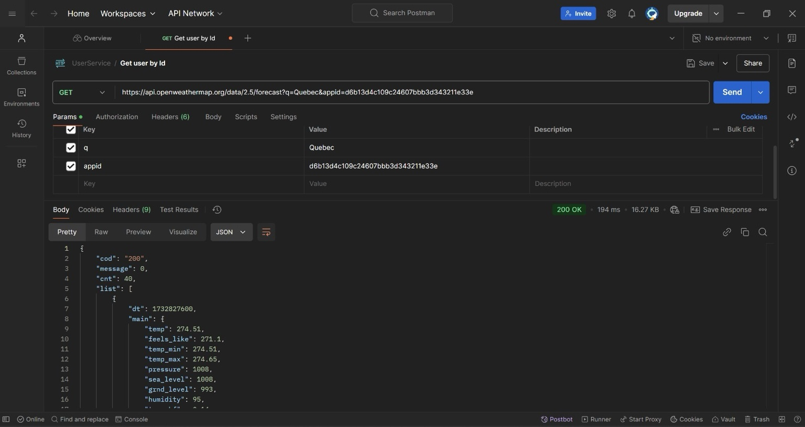

#Weather APP

## Weather App Interface
The Weather App provides the following features:
1. Displays the **current weather details** for a selected city.
2. Provides a **5-day weather forecast**.

.png)

---

## API Integration Details

### API Provider
The Weather App utilizes the **OpenWeatherMap API** to fetch weather data.
The following screenshot shows the API request details made to OpenWeatherMap. It includes the request parameters, such as city and API key, and a sample JSON response.

